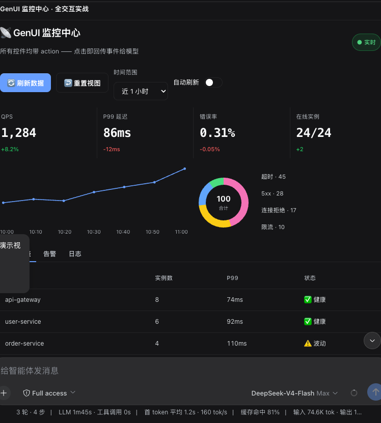

# 🎨 dsh-genui

> 让模型的回答长出界面——文字还在，可交互的 UI 已经能用。

模型不再只回你文字。装上它，你问"这个月订单怎么样"，它一边分析一边在回答里渲染出一张**能点的数据面板**：看趋势、拖滑块、按刷新，模型会真的响应你。

<div align="center">

https://github.com/user-attachments/assets/f5db33ec-7471-4d4a-a85b-79c9962ab4ef

</div>

<p align="center">
  
  <br><em>实际效果：模型输出的一块可交互监控面板（点「刷新」它会重新生成数据）</em>
</p>

> 播放器没出来可 [下载 mp4](./assets/demo.mp4)；四幕演示脚本见 [demo-prompts.md](./demo-prompts.md)。

---

## ⚠️ 先看这里：dsh 版本要求（重要）

本插件依赖 dsh 主仓的 **fence-registry 扩展点**（commit `47d230e`，2026-08-09 加入）。

在此之前的内测构建（包括 08-08 快照 `snapshots/20260808T121140Z`）**没有**该扩展点和 genui 相关 API，装上插件后会出现：

- `dsh-ui` fence 不渲染（插件装了也完全没反应）
- 更早的构建在渲染时**整个聊天界面白屏**（渲染器调用了不存在的 API）

**先更新 dsh，再装插件**：

```sh
# 方法一：在 dsh 源码目录里重新执行安装器（更新默认分支并重新构建）
cd <dsh源码目录> && scripts/install.sh
# 方法二：重新 clone 主仓后构建
git clone <dsh仓库地址> && cd <dsh目录> && scripts/install.sh

# 更新后确认版本达标（两条都过才说明版本没问题）：
git -C <dsh源码> log -1 --oneline
#   输出应 >= 47d230e（feat(genui): fence-registry extension point）
grep -r registerFenceRenderer <dsh源码>/packages/client/ui-primitives/src/
#   应有输出
```

> 主仓默认分支已更新到含 fence-registry 的版本（旧快照保留在 tag `snapshot-20260808T121140Z-7f25d3e98c`），重新 clone 或 rerun 安装器即可拿到。

---

## ✨ 装之前 vs 装之后

| 普通回答 | 装了 dsh-genui |
|---|---|
| "本月收入 ¥128,430，环比 +12.4%，建议关注转化率。" | 一行分析 + 旁边直接渲染：收入/订单/转化率三张统计卡、趋势图、进度条 |
| 想再看别的？再打一段字问一遍 | 面板上就有「刷新」「切换视图」按钮，点一下，模型更新数据 |

## 🚀 快速开始（内测成员）

前置条件，缺一不可：

1. **dsh 是最新内测版**：需含 `fence-registry` 扩展点（commit ≥ `47d230e`，2026-08-09 之后）。**旧版（含 08-08 快照）装上会 fence 不渲染或聊天白屏**——先按上方「dsh 版本要求」更新 dsh 再装
2. **`pnpm` 在 PATH 上**：`dsh plugin` 命令依赖它。没有就 `corepack enable`（或 `npm i -g pnpm`），然后**新开一个终端**，确认 `pnpm -v` 有输出
3. **GitHub 已登录**：插件仓库在私有组织 `dsh-external`，需要 `gh auth login` 或已配置 git credential helper

安装（一行命令，自动带上全部依赖）：

```sh
dsh plugin --profile web add git+https://github.com/dsh-external/dsh-genui.git
```

> ⚠️ **别用 `link:` 装一个刚 clone 的目录**——`link:` 不会安装插件的依赖（mermaid / three / react），装完渲染器会挂。请用上面的 git URL 方式；只有本地开发迭代才用 link:（见下文）。

重启 dsh web + 硬刷新，新会话里说"用 dsh-ui 画个统计看板"验证。

### 一键脚本（推荐）

clone 后直接跑，脚本会检查上述三个前置、执行安装、并提示重启：

```sh
git clone https://github.com/dsh-external/dsh-genui.git
cd dsh-genui
./scripts/install.sh
```

### 开发者迭代（link 模式）

```sh
cd dsh-genui
pnpm install
dsh plugin --profile web add link:$PWD
```

## 🧩 它能做什么

- **回答即界面**：组件嵌在回答里，边生成边出现，不用等整段写完
- **30+ 组件**：卡片、表格、图表、表单、标签页、折叠面板、文件树、时间线、diff……
- **函数图**：`plot` 画曲线，参数滑块拖动实时重绘，支持自动动画

<p align="center">
  
</p>

- **测验**：`quiz` 点选判题 + 解析 + 重试
- **事件循环**：按钮/开关带 `action`，点击回传模型，模型更新界面；同名 action 300ms 尾沿防抖，连点合并为一次（最后一次的值生效）
- **工具通道**：`render_ui` 工具把同一份 spec 渲染成工具行卡片（交付物型 UI 走工具、回答型 UI 走围栏）
- **会话面板**：composer 上方常驻 dock，`render_ui` / `panel: true` 围栏原地更新同一块界面；`/panel` 命令客户端直开（`/panel <指令>` 转模型定制、`/panel clear` 清空）；顶边框可拖拽调高；`append: true` 增量合并——同名标签页追加内容、新标签页新增，面板可无限长大，不受单条消息大小限制
- **自愈与上限**：每个围栏过规格守卫——坏节点静默丢弃、数值钳位、字符串截断，整树 ≤200 节点 / 8 层嵌套，病态 spec 不会拖垮界面
- **图错误自愈**：mermaid 渲染失败自动修复重试（剥反引号、引号化中文/空格标签、去 `<br/>`），仍失败才降级源码；错误图永不直接上屏
- **可访问性**：tabs/折叠/开关/进度条带完整 ARIA 与键盘导航（方向键切页、Home/End 跳转）
- **零打扰**：不装插件时围栏只是代码块，不报错、不污染会话

组件 JSON 语法见 [SKILL.md](./SKILL.md)（也可复制到 `~/.dsh/skills/genui/` 增强模型使用）。

## 📄 示例

模型输出这段围栏（写给浏览器看的，你不用读懂）：

```dsh-ui
{"title":"订单概览","items":[
  {"type":"stat","label":"总收入","value":"¥128,430","delta":"+12.4%"},
  {"type":"stat","label":"订单数","value":"1,024","delta":"-3.1%"}
]}
```

你看到的是两张统计卡片。

## 🔧 原理

模型把界面描述写成 JSON 放进 `dsh-ui` 围栏，浏览器端渲染器（`src/client`）通过主仓 `fence-registry` 接口认领这门语言并渲染。组件是白名单的，模型塞不进 HTML/脚本；函数表达式走独立解析器，不用 eval。

## ❓ 常见问题

- **显示成代码块？** 查三处：dsh 版本带 fence-registry（见顶部「版本要求」，旧版会不渲染）、`dsh plugin --profile web list` 里有本插件、重启 + 硬刷新。
- **渲染 dsh-ui fence 时聊天界面白屏？** dsh 版本太旧（< 47d230e）——先更新 dsh 再重装插件，见顶部「版本要求」。
- **`dsh: pnpm not found on PATH`？** 装 pnpm 后**新开终端**再试（`corepack enable` 或 `npm i -g pnpm`）。
- **安装时卡在 git 凭据/404？** 仓库在私有组织，先 `gh auth login`，再用 git URL 方式安装。
- **装了但 scene3d/mermaid 不渲染？** 多半是用 `link:` 装的干净 clone，依赖没进去——卸掉改用 git URL 方式重装（`dsh plugin --profile web remove @deepseek-ai/dsh-genui` 后再 add）。
- **模型不主动输出？** 重启后新会话生效；或直接说"用 dsh-ui 输出"。
- **clone 后没有 lib/？** `pnpm install && pnpm run check` 自己构建。

## 🧑‍💻 开发

```sh
pnpm install
pnpm run check   # 类型检查 + 135 测试 + 构建
```

### 真机 e2e

真实链路验证：起一个临时 dsh web → 装上插件 → 浏览器里发消息让模型输出 `dsh-ui` fence → 断言渲染 → 点击 action 按钮 → 断言模型响应（事件循环闭环）：

```sh
DEEPSEEK_API_KEY=sk-... node scripts/e2e.mjs          # link 安装当前工作区
DEEPSEEK_API_KEY=sk-... node scripts/e2e.mjs --install git   # 朋友路径（git URL）
```

前置：`dsh`/`pnpm` 在 PATH、`DEEPSEEK_API_KEY`、主仓 web 构建产物（playwright 从主仓解析）。PASS 时保存 `e2e-final.png` 截图。

## 🗺️ Roadmap（已评估项）

| 方向 | 结论 | 理由 |
|---|---|---|
| 增量 patch（模型只发 diff 不重发全量 spec） | 不做 | fence 一次 200–800 token，重发代价极小；patch 协议的教学成本与出错率不值得。若未来出现秒级自动刷新面板再议 |
| action 防抖/去重 | ✅ 已做（300ms 尾沿，按 action 名独立） | 连点刷屏是真实摩擦，收口点一处改动 |
| 跨会话状态持久化（回放恢复 tabs/开关） | 不做 | 回放重置是更正确的默认行为（模型已用新 fence 更新过界面）；流式期间状态天然保留 |
| MCP 适配器 / 独立画廊页 / i18n | 不做 | 无跨工具需求信号；画廊素材已被 `gallery.ts` + demo-prompts + README 截图覆盖；内置文案仅 6 处 |

测试解析 dsh 源码（`vitest.config.ts` 的 `DSH_ROOT`，默认 `~/.dsh/source/current`）。

---

📄 License: MIT
