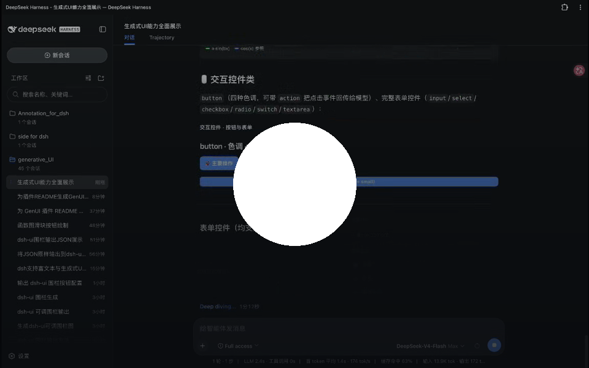

# dsh-genui

给 DeepSeek Harness 的模型装上一支"画笔"：它能在回答里直接画出可交互的界面——数据面板、图表、函数曲线、表单、测验题，甚至 3D 场景。你还能点里面的按钮、拖滑块，模型会响应你的操作并更新界面。

> 视频区：等 user-attachments 原生播放器链接（见下方说明）

[](./assets/demo.mp4)

## 特性

- **回答即界面**：组件是回答的一部分，不是工具卡片；文字和 UI 自由穿插
- **流式渲染**：回答还在生成，写完的组件就逐个出现，不用等整段结束
- **30+ 组件**：排版、卡片、表格、统计、图表、表单、标签页、折叠面板、复制按钮……
- **数学函数图**：`plot` 画曲线，参数滑块实时拖动（y 轴锁定），支持自动动画播放
- **教学组件**：`quiz` 点击判题 + 解析 + 重试；步骤条、提示框配合讲解
- **事件循环**：按钮/开关/下拉带 `action`，点击回传模型，模型执行后输出更新后的界面
- **可视化全家桶**：mermaid 流程图/时序/甘特、WebGL 3D 场景（拖拽旋转）、文件树、时间线、diff、JSON 树
- **零打扰**：不装插件时 dsh-ui 围栏退化为普通代码块，不报错、不影响会话

## 安装

前置：dsh 版本包含 `fence-registry` 扩展点（`registerFenceRenderer`，当前内测构建都有）。确认：

```sh
grep -r registerFenceRenderer <dsh源码>/packages/client/ui-primitives/src/
```

有输出即可安装：

```sh
git clone https://github.com/dsh-external/dsh-genui.git
dsh plugin --profile web add link:/path/to/dsh-genui
# 重启 dsh web，浏览器硬刷新（Cmd+Shift+R）
```

装好后新开会话，让模型"用 dsh-ui 画一个统计看板"验证。

可选：把 [SKILL.md](./SKILL.md) 复制到 `~/.dsh/skills/genui/`，模型会更主动地使用 plot 滑块、quiz 等进阶组件。

## 示例

模型输出下面这段围栏（这是它写给浏览器看的，你不用读懂）：

```dsh-ui
{"title":"订单概览","items":[
  {"type":"stat","label":"总收入","value":"¥128,430","delta":"+12.4%"},
  {"type":"stat","label":"订单数","value":"1,024","delta":"-3.1%"},
  {"type":"progress","label":"本月目标","value":72,"valueLabel":"72%"}
]}
```

你看到的就是一排统计卡片。完整组件语法见 [SKILL.md](./SKILL.md)。

## 工作原理

模型把界面描述写成 JSON 放进 `dsh-ui` 围栏 → 浏览器端渲染器（`src/client`）通过主仓 `fence-registry` 扩展点认领该语言 → 渲染为白名单组件。组件是数据驱动的，模型无法注入 HTML/脚本；函数表达式走独立解析器（无 eval）。没装插件时围栏显示为代码块，安全降级。

## 常见问题

**dsh-ui 显示为代码块**：确认① dsh 带 fence-registry ② `dsh plugin --profile web list` 里有 @deepseek-ai/dsh-genui ③ 重启 + 硬刷新。

**模型不主动输出**：插件注入的语法说明对新会话生效（重启后）；或直接说"用 dsh-ui 输出"。

**clone 后没有 lib/？**：构建产物随仓库分发，缺失时 `pnpm install && pnpm run check` 自建。

## 开发

```sh
pnpm install
pnpm run check   # 类型检查 + 63 测试 + 构建
```

测试经 vitest 解析 dsh 源码（`vitest.config.ts` 的 `DSH_ROOT`，默认 `~/.dsh/source/current`）。

## License

BSD-3-Clause
